

 # Chaos Organaizer

## Ключевая идея
Приложение для хранения информации. Вы можете хранить информации, как в виде текста, ссылок, видео и аудио.
Также вы самостоятельно можете записывать свои аудио и видео сообщения.

## Основные функции 
 - сохранение в истории ссылок и текстовых сообщений;
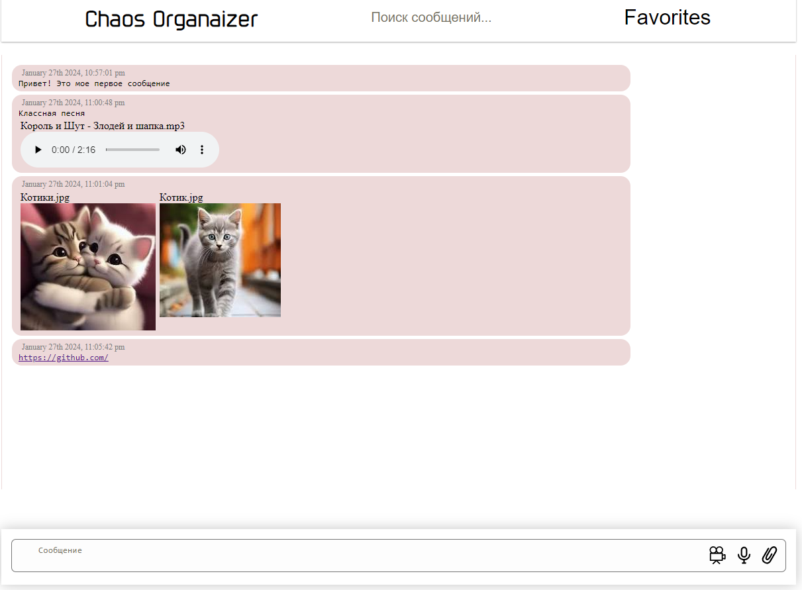
 - ссылки (http://) или (https://) кликабельны и отображаются как ссылки;
 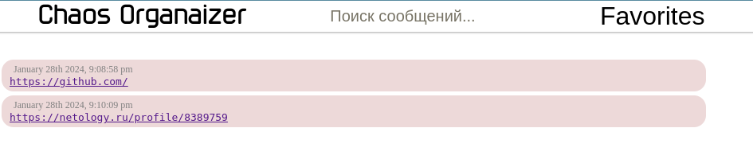
 - сохранение в истории изображений, аудио и видео (как файлов) - через Drag & Drop и через иконку загрузки;
 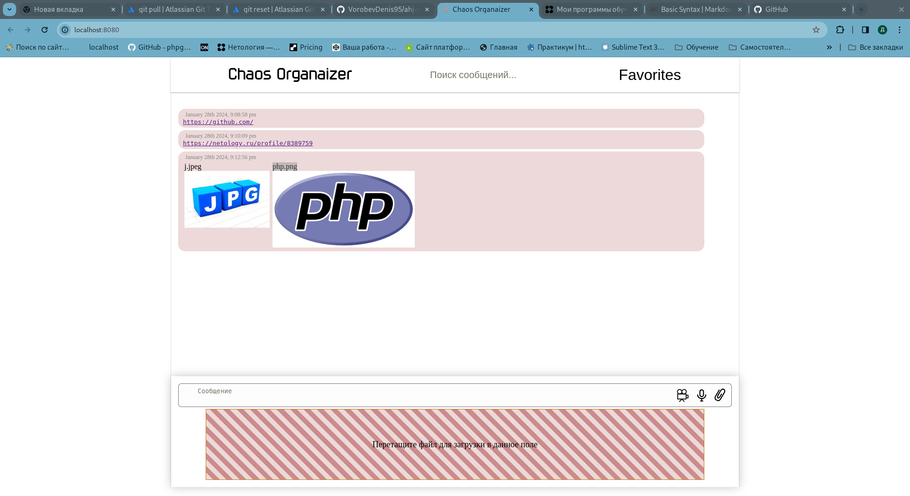
 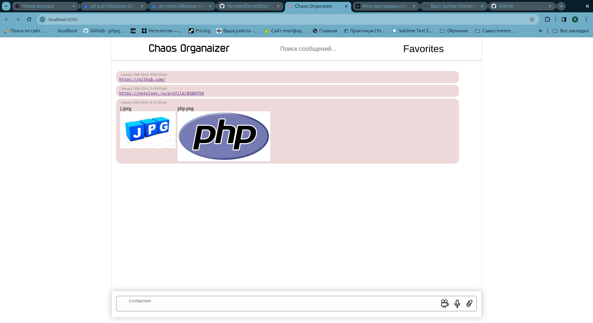
 - скачивание файлов на компьютер пользователя (при нажатии на файл в окне сообщений или в соответствующей категории бокового меню);
 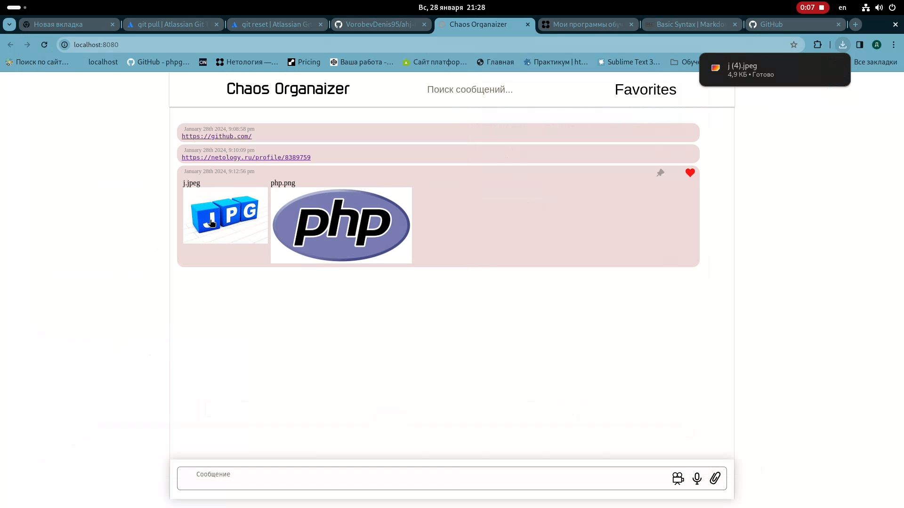
 - ленивая подгрузка сначала подгружаются последние 10 сообщений, при прокрутке вверх подгружаются следующие 10 и т.д;
 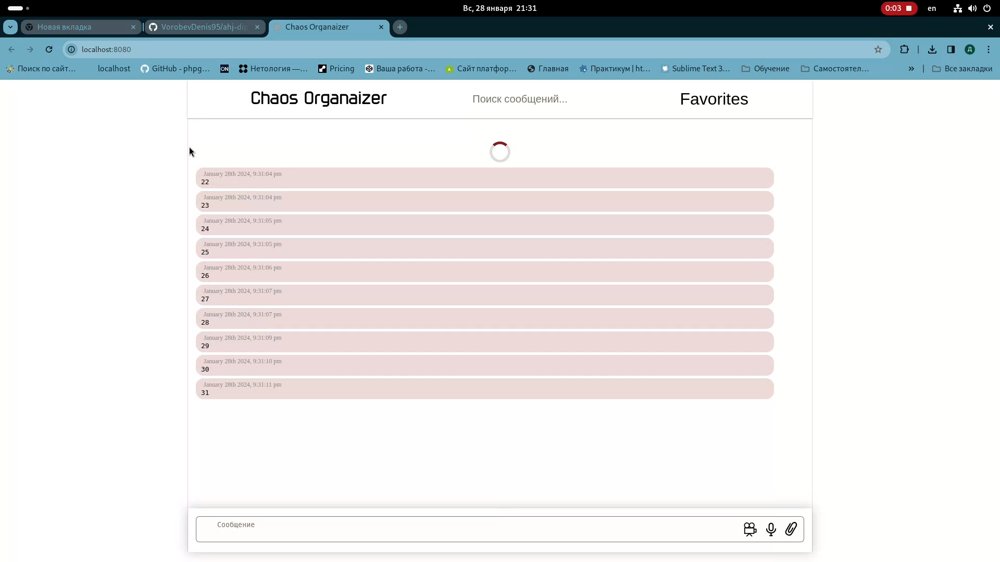
 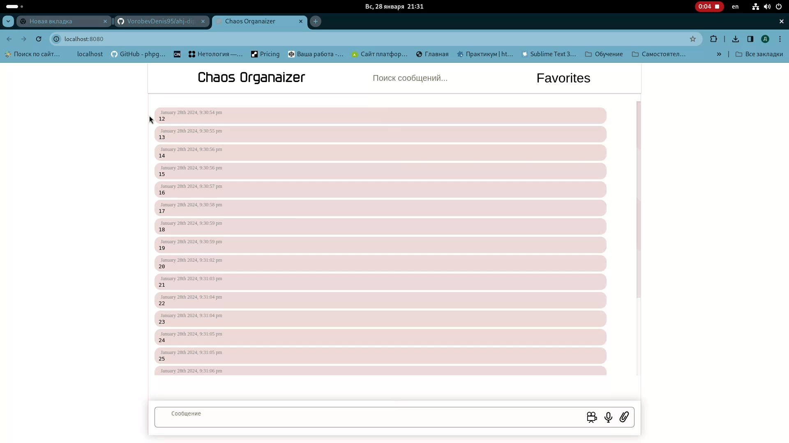
  
## Дополнительные функции

- поиск по сообщениям (интерфейс + реализация на сервере);
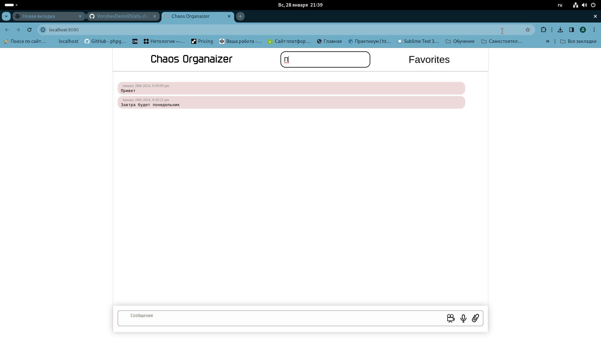
- воспроизведение видео/аудио через API браузера;
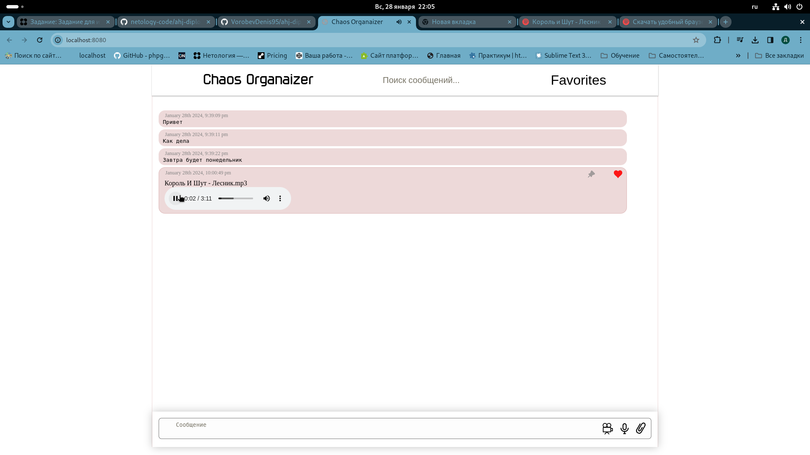
- запись видео/аудио, используя API браузера;
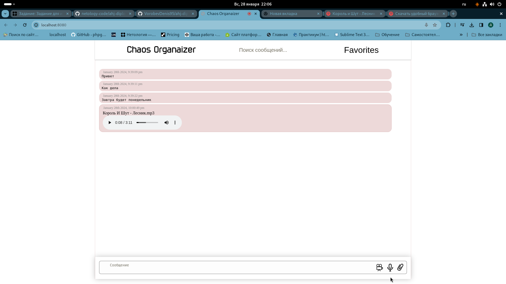
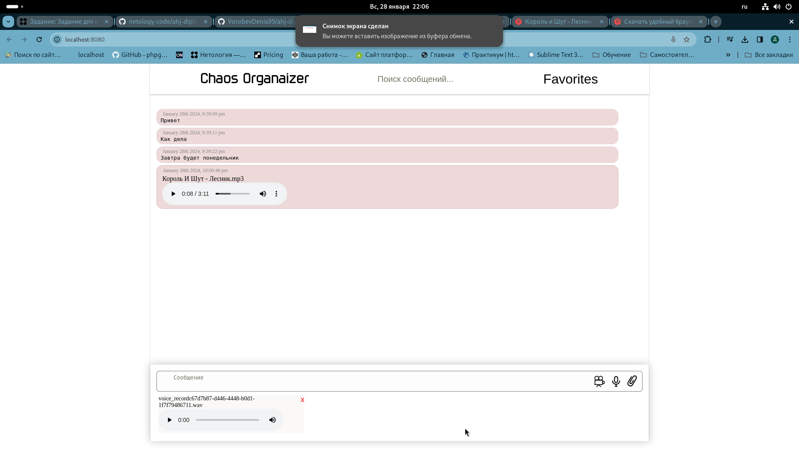
- закрепление (pin) сообщений: закреплять можно только одно сообщение, оно прикрепляется к верхней части страницы:
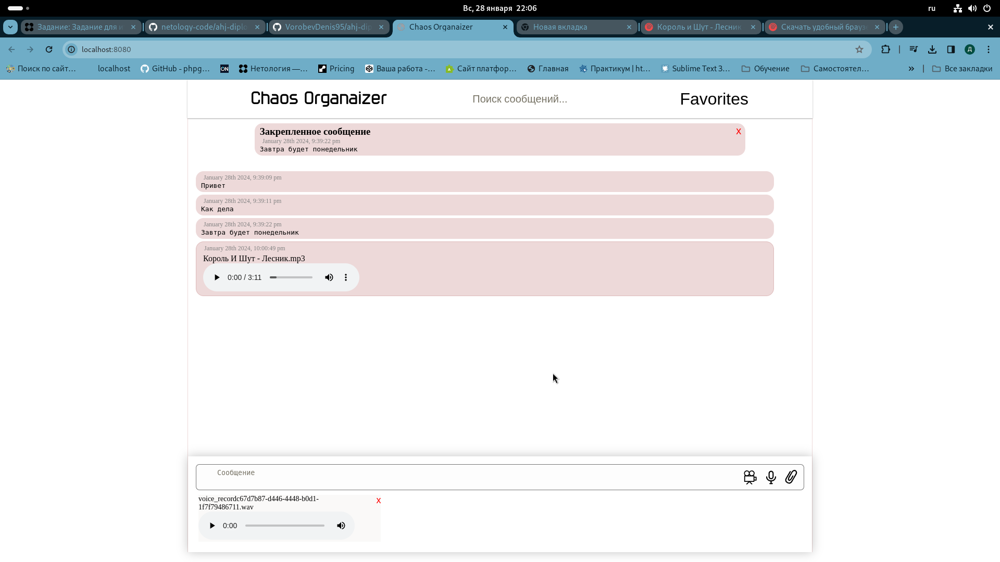
- добавление сообщения в избранное, должен быть интерфейс для просмотра избранного;
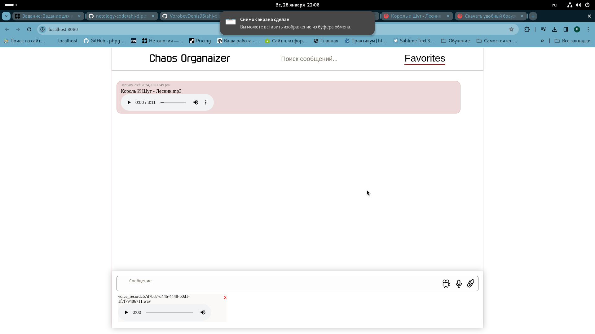